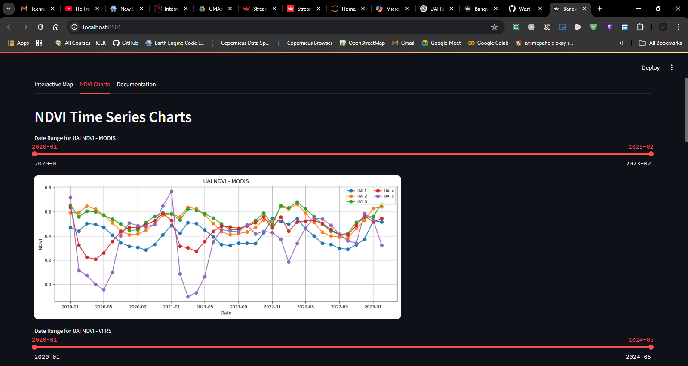

# acre_assessment

Young Professional GIS/Remote Sensing Practical Evaluation

# Workflow Overview

This file outlines the geospatial workflow developed to generate edible vegetation masks and segment Unit Areas of Insurance (UAIs) using satellite-derived vegetation indices. The methodology integrates MODIS NDVI, ESA WorldCover, and additional datasets to support forage monitoring across GMAs.
Objective: To derive an edible vegetation mask and segment the landscape into Unit Areas of Insurance (UAIs) using NDVI and supporting datasets. This supports forage indexing in Game Management Areas (GMAs) from 2020 to 2024.

### Methodology

The following sections outline the methodology applied to my automation pipeline. These have been expounded on using raw cells in the Notebook file attached (.ipynb).

1. **Load Area of Interest (AOI):** Game Management Areas (GMAs)
2. **Load MODIS NDVI Data:** 2020–2024
3. **Load Sentinel-2 Mosaic and ESA WorldCover:** 2020/2021 for Land Cover Data
4. **Calculate NDVI Amplitude and Mean:** 2020–2024
5. **Create Land Cover Masks**
6. **Create Edible and Non-Edible Vegetation Layers**
7. **Cluster Edible Vegetation Areas:** Using SNIC Segmentation
   - **Clustering Edible Vegetation Regions into UAIs**
8. **Extracting Monthly NDVI Time Series for UAIs:** 2020–2024
   - **Extracting Monthly NDVI Time Series using VIIRS NDVI:** 2020–2024
9. **Task 2: Multi-Index UAI Segmentation (MCDA)**
   - **Load and Prepare Additional Datasets:** LAI, Precip, Soil Moisture
   - **Multi-Criteria Decision Analysis (MCDA) and New UAI Segmentation**
   - **Monthly NDVI Time Series for MCDA-based UAIs**
   - **VIIRS vs MODIS Time Series over MCDA-based UAI Zones**
   - **NDVI-only vs MCDA-UAIs: Time Series Comparison (MODIS Only)**
10. **Maps, Raster Exports, and Dashboard Preparation**
    - **Export Land Cover Masks as GeoTIFFs**
    - **Process shapefiles from GeoTIFFs**
    - **Build Interactive Map to Visualize Outputs**
    - **Using Streamlit to package all outputs into a single Dashboard, Interactive Map, Charts, and Documentation Summary**

# Rationale

The rationale behind the workflow is to establish a reproducible, automated method for isolating edible vegetation zones that vary seasonally, allowing risk-based segmentation and comparison between NDVI-only and multi-criteria approaches for defining UAIs. One of the major differences highlighted between the two methods is that MDCA resulted in more compact clusters compared to NDVI only units Segmentation.

# Challenges

Some challenges encountered incomplete datasets, leading to inconclusive outputs and visualization of the same. Recommend merging multiple datasets with same configuration e.g bands – MODIS and VIIRS
Heavy and slow processing of shapefiles output due to complex geometries and dense number of polygons.

## Dashboard Deployment

The project is deployed using **Streamlit** and can be accessed at:

🔗 [acre-assessment.streamlit.app](https://acre-assessment.streamlit.app/)

### Preview

**Map**  

**NDVI Charts**  

**Documentation**  

